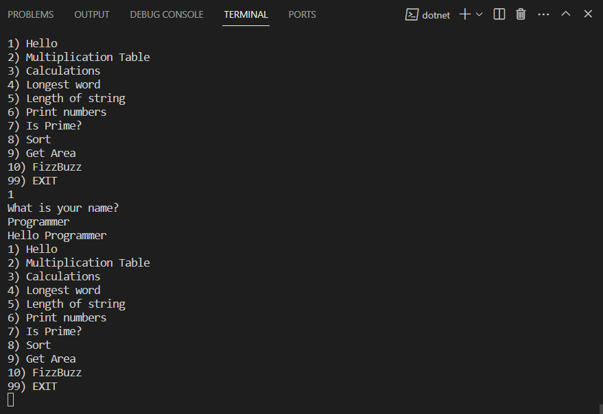

# csharp-basics
- In this repository we explore the basics of csharp
- This is a c# console application with a menu

In the menu folder, Program.cs file is the console application. And we can run this on terminal by: 

```
cd .\menu\
dotnet run
```

How our app looks:

